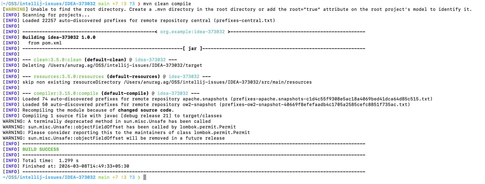

# IDEA-373032

The processor path calculated for maven 4 by intellij is not correct:

```text
~/.m2/repository/io/micronaut/micronaut-inject/4.9.1/micronaut-inject-4.9.1.jar:~/.m2/repository/io/micronaut/micronaut-inject/4.10.17/micronaut-inject-4.10.17.jar:~/.m2/repository/com/github/javaparser/javaparser-core/3.27.0/javaparser-core-3.27.0.jar:~/.m2/repository/jakarta/inject/jakarta.inject-api/2.0.1/jakarta.inject-api-2.0.1.jar:~/.m2/repository/io/micronaut/micronaut-inject-java/4.10.17/micronaut-inject-java-4.10.17.jar:~/.m2/repository/io/micronaut/sourcegen/micronaut-sourcegen-bytecode-writer/1.8.2/micronaut-sourcegen-bytecode-writer-1.8.2.jar:~/.m2/repository/org/slf4j/slf4j-api/2.0.17/slf4j-api-2.0.17.jar:~/.m2/repository/io/micronaut/sourcegen/micronaut-sourcegen-model/1.8.2/micronaut-sourcegen-model-1.8.2.jar:~/.m2/repository/jakarta/annotation/jakarta.annotation-api/2.1.1/jakarta.annotation-api-2.1.1.jar:~/.m2/repository/com/github/javaparser/javaparser-symbol-solver-core/3.27.0/javaparser-symbol-solver-core-3.27.0.jar:~/.m2/repository/io/micronaut/micronaut-aop/4.10.17/micronaut-aop-4.10.17.jar:~/.m2/repository/org/projectlombok/lombok/1.18.42/lombok-1.18.42.jar:~/.m2/repository/io/micronaut/micronaut-core/4.10.17/micronaut-core-4.10.17.jar:~/.m2/repository/org/checkerframework/checker-qual/3.49.4/checker-qual-3.49.4.jar:~/.m2/repository/io/micronaut/micronaut-core-processor/4.10.17/micronaut-core-processor-4.10.17.jar:~/.m2/repository/io/micronaut/micronaut-inject/4.9.1/micronaut-inject-4.9.1.jar:~/.m2/repository/io/micronaut/micronaut-inject/4.10.17/micronaut-inject-4.10.17.jar:~/.m2/repository/com/github/javaparser/javaparser-core/3.27.0/javaparser-core-3.27.0.jar:~/.m2/repository/jakarta/inject/jakarta.inject-api/2.0.1/jakarta.inject-api-2.0.1.jar:~/.m2/repository/io/micronaut/micronaut-inject-java/4.10.17/micronaut-inject-java-4.10.17.jar:~/.m2/repository/io/micronaut/sourcegen/micronaut-sourcegen-bytecode-writer/1.8.2/micronaut-sourcegen-bytecode-writer-1.8.2.jar:~/.m2/repository/org/slf4j/slf4j-api/2.0.17/slf4j-api-2.0.17.jar:~/.m2/repository/io/micronaut/sourcegen/micronaut-sourcegen-model/1.8.2/micronaut-sourcegen-model-1.8.2.jar:~/.m2/repository/jakarta/annotation/jakarta.annotation-api/2.1.1/jakarta.annotation-api-2.1.1.jar:~/.m2/repository/com/github/javaparser/javaparser-symbol-solver-core/3.27.0/javaparser-symbol-solver-core-3.27.0.jar:~/.m2/repository/io/micronaut/micronaut-aop/4.10.17/micronaut-aop-4.10.17.jar:~/.m2/repository/org/projectlombok/lombok/1.18.42/lombok-1.18.42.jar:~/.m2/repository/io/micronaut/micronaut-core/4.10.17/micronaut-core-4.10.17.jar:~/.m2/repository/org/checkerframework/checker-qual/3.49.4/checker-qual-3.49.4.jar:~/.m2/repository/io/micronaut/micronaut-core-processor/4.10.17/micronaut-core-processor-4.10.17.jar
```

When building from IntelliJ, we get the following error:


This issue occurs when using these settings:


However, the error doesn't occur when building directly from maven:



This processor path calculated with maven 3 works correctly.

