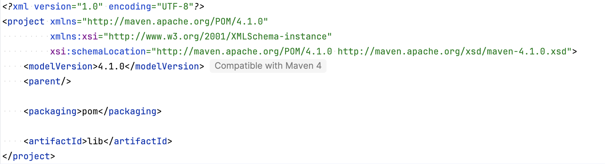
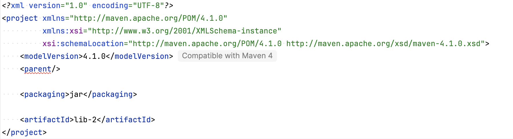
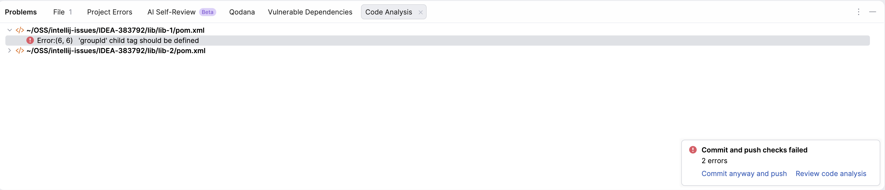
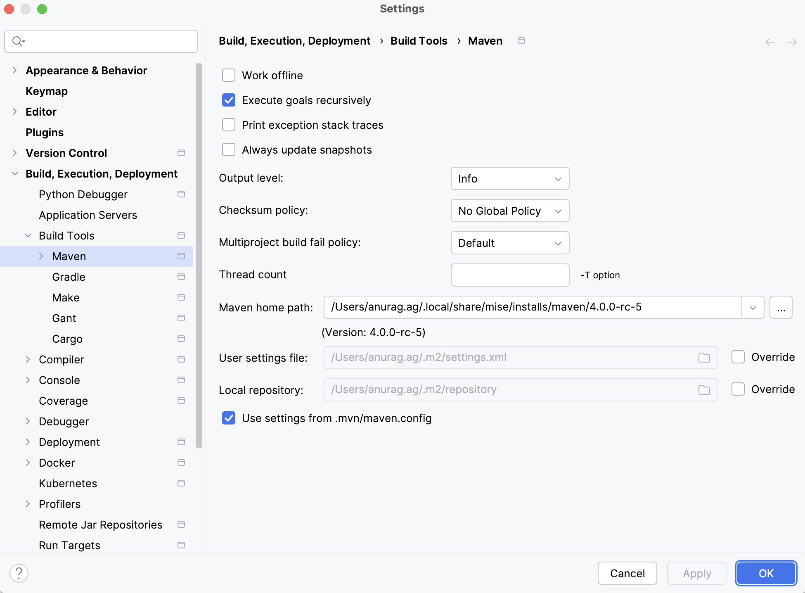

# IDEA-383792: IntelliJ fails to recognize parent in Maven 4 multi-module project with `<parent/>`

In Maven 4, the `<parent/>` tag (with no content) can be used to indicate that the parent POM should be discovered from the file system (typically the directory above).

## Issue Description

In this multi-module Maven 4 project, IntelliJ's behavior is inconsistent regarding the discovery of parent POMs when using the `<parent/>` tag.

### Case 1: Direct Child (Working)
For the `lib` module, which is a direct child of the root project, IntelliJ correctly recognizes the root POM as its parent and does not display any errors.

### Case 2: Nested Child (Error)
For modules like `lib-1` or `lib-2`, which are nested inside the `lib` directory and are supposed to use `lib` as their parent, IntelliJ fails to recognize `lib` as the parent. This results in errors being highlighted in the `pom.xml` file.

## Project Structure
The project structure is as follows:
- `pom.xml` (Root, Maven 4.1.0)
- `lib/`
  - `pom.xml` (Parent is root, uses `<parent/>`)
  - `lib-1/`
    - `pom.xml` (Parent is `lib`, uses `<parent/>` - **IntelliJ shows error here**)
  - `lib-2/`
    - `pom.xml` (Parent is `lib`, uses `<parent/>` - **IntelliJ shows error here**)

## Environment
- Maven 4.1.0
- IntelliJ IDEA with Maven 4 support

